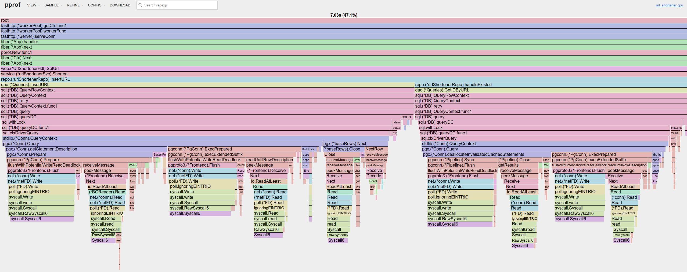

# url_shortener

<!--toc:start-->
- [url_shortener](#urlshortener)
  - [Stack](#stack)
  - [Stress test results](#stress-test-results)
    - [V1. Use auto-increment key](#v1-use-auto-increment-key)
      - [POST](#post)
      - [GET](#get)
  - [Thoughts](#thoughts)
<!--toc:end-->

a simple url shortener service written in Go

## Stack

- web framework: `Fiber`
- DB: `PostgreSQL`
- DB toolchain: `migrate`, `sqlc`
- Container/Orchestration: Docker/Docker compose
- Stress test: `wrk`
- Profiling: `pprof`

## Stress test results

### V1. Use auto-increment key

The version V1 implements the basic functionalities of a url shortener. I used
the database's auto-incremented primary key as the slug, with the base62
format.

The string is not "random" at all, but after some queries, we could have
something like `http://localhost:3000/2AW9` that can satisfy the need.

I tested the parts that could easily go wrong during the dev, that is the
POST handler validation part and the base62 encoder and decoder. For the rest
of the code, it doesn't have a lot of logic, so a manual test is sufficient.

I added `wrk` script to run the stress test which by the way verified the
validation of 2 handlers.

The SQL commands generated by `sqlc` can be tested separately so that we can
create a mock for `sqlc` generated code for integration tests without the
real DB connection.

#### POST

3000 - 3500 QPS

```bash
<@url_shortener>-<⎇ main>-> wrk -t2 -d30s -c10 -s ./scripts/wrk/shorten.lua http://localhost:3000/
Running 30s test @ http://localhost:3000/
  2 threads and 10 connections
  Thread Stats   Avg      Stdev     Max   +/- Stdev
    Latency     3.17ms    1.17ms  16.14ms   61.95%
    Req/Sec     1.59k   584.07     3.24k    80.83%
  95024 requests in 30.01s, 12.96MB read
Requests/sec:   3166.17
Transfer/sec:    442.15KB
<@url_shortener>-<⎇ main>-<±>-> wrk -t2 -d30s -c10 -s ./scripts/wrk/shorten.lua http://localhost:3000/
Running 30s test @ http://localhost:3000/
  2 threads and 10 connections
  Thread Stats   Avg      Stdev     Max   +/- Stdev
    Latency     2.81ms    1.14ms  12.12ms   66.73%
    Req/Sec     1.79k   663.18     3.16k    70.00%
  106860 requests in 30.01s, 14.57MB read
Requests/sec:   3561.01
Transfer/sec:    497.29KB
```




#### GET

16000 - 20000 QPS (**Before adding the count**)

```bash
<@url_shortener>-<⎇ main>-<±>-> wrk -t2 -d30s -c10 -s ./scripts/wrk/get.lua http://localhost:3000/2AW9
Running 30s test @ http://localhost:3000/2AW9
  2 threads and 10 connections
  Thread Stats   Avg      Stdev     Max   +/- Stdev
    Latency     1.37ms    6.41ms 131.83ms   97.51%
    Req/Sec     8.18k     2.96k   11.78k    65.33%
  488349 requests in 30.00s, 50.30MB read
Requests/sec:  16276.73
Transfer/sec:      1.68MB
```


**700 QPS** after changing from a get to update

```bash
<@url_shortener>-<⎇ main>-> wrk -t2 -d30s -c10 -s ./scripts/wrk/get.lua http://localhost:3000/ABC
Running 30s test @ http://localhost:3000/ABC
  2 threads and 10 connections
  Thread Stats   Avg      Stdev     Max   +/- Stdev
    Latency    15.24ms   11.37ms 131.12ms   82.83%
    Req/Sec   361.55     44.87   490.00     71.17%
  21608 requests in 30.02s, 2.35MB read
Requests/sec:    719.82
Transfer/sec:     80.14KB
```

### V2 Use snowflake UUID

I saw 2 potential problems with autoincrement ID.

1. It is too predictable, and not that random
2. We depends on ONE database. It will be difficult to scale.

So I switched to snowflake in order to generate global unique ID, so that
we can scale more easily and always have a link like:
`http://localhost:3000/2EwYPl5Nzw8`

### V3 Use redis as message queue

I've chosen redis for the simplicity, because I only need to communicate the
ID. This logic can eventually evolve and we could use a proper message queue 
at that moment.

With async sending the message, we reached 10000 QPS for the GET handler. It's
about more than x10 performance improvements.

What we sacrificed here though, is the real-time count result. Since we started
a tity consumer that update the counter to not saturate the database, we
could experience significant message backlog.

We can eventually adjust the number of consumers (or connections) with the GET handler's
performance and find a balance.

```bash
<@url_shortener>-<⎇ main>-<±>-> wrk -t2 -d30s -c10 -s ./scripts/wrk/get.lua http://localhost:3000/2EwYPl5Nzw8
Running 30s test @ http://localhost:3000/2EwYPl5Nzw8
  2 threads and 10 connections
  Thread Stats   Avg      Stdev     Max   +/- Stdev
    Latency     1.53ms    3.05ms  42.24ms   94.57%
    Req/Sec     5.35k     1.68k    8.30k    68.00%
  319219 requests in 30.01s, 32.88MB read
Requests/sec:  10637.15
Transfer/sec:      1.10MB
<@url_shortener>-<⎇ main>-<±>-> wrk -t2 -d30s -c10 -s ./scripts/wrk/get.lua http://localhost:3000/2EwYPl5Nzw8
Running 30s test @ http://localhost:3000/2EwYPl5Nzw8
  2 threads and 10 connections
  Thread Stats   Avg      Stdev     Max   +/- Stdev
    Latency     1.26ms    1.89ms  48.87ms   97.02%
    Req/Sec     4.85k   765.03     7.57k    77.67%
  289322 requests in 30.01s, 29.80MB read
Requests/sec:   9642.03
Transfer/sec:      0.99MB
```

## Thoughts

- I chose `Fiber` and `sqlc` because in another showcase project `secumon` I have
used `Gin` and `Gorm`. It is to show that I can adapt with different tools
based on the existent project setup.
- At `dao` level, I have directly put the generated code. The advantage is that
we have reduced a level of abstraction that "does nothing". But the
inconvenience is that in `repo` level, we depend on `pgConn.pgError` that has
to be changed if we change to another middleware like `GORM`. But it is
acceptable for the sake of simplicity.
- After adding the click count feature, it seems that I touched the limit of
the database. One way to improve that is to asynchronously write the count
by using a message queue.
- There is another way to do that. That is to use a hashing algorithm like
`murmurhash`. In case of hash conflict, we can prepend some special characters
to the url to get a new hash. The logic might be a little more complex to
handle the conflict, but since it should not happen a lot, we can accept that.
The advantage is that we don't have to keep the index of the full url, which
can be expensive when the DB grows.
